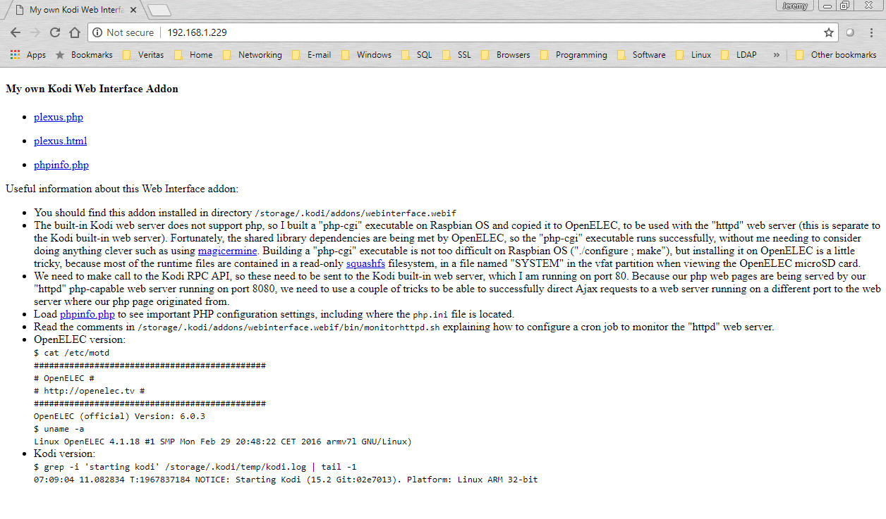
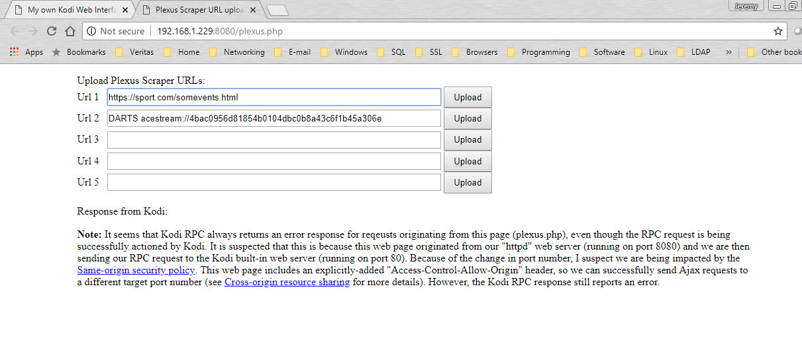

# webinterface.webif

This is a Kodi web interface addon. The main purpose of this addon is to make it easy to add a URL to the settings page of my Kodi "Plexus Scraper" addon. 

The files in this addon should be installed here on the Pi:  
`/storage/.kodi/addons/webinterface.webif`  

See document "resources/Using PHP with the Kodi web server.docx" for additional configuration steps, including how to update the read-only squashfs filesystem.  

  
  

JeremyC 2018

